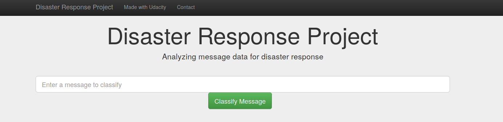

# Disaster Response Application



The raw dataset was provided by [Figure Eight](https://www.figure-eight.com/) contains pre-labelled tweet and messages from real-life disaster. 
The aim of the project is to build a Natural Language Processing tool that categorize messages.

The Project is divided in the following Sections:

1. Data Processing, ETL Pipeline to extract data from source, clean data and save them in a proper database structure
2. Machine Learning Pipeline to train a model able to classify text message in categories
3. Web App to show model results in real time. 

## Getting Started

### Installing Dependencies
Clone this GIT repository and install required packages.
```
git clone https://github.com/arunnthevapalan/disaster-response-app.git
pip install -r requirements.txt
```

### Executing Program:
1. Run the following commands in the project's root directory to set up your database and model.

    - To run ETL pipeline that cleans data and stores in database
        `python data/process_data.py data/disaster_messages.csv data/disaster_categories.csv data/DisasterResponse.db`
    - To run ML pipeline that trains classifier and saves
        `python models/train_classifier.py data/DisasterResponse.db models/classifier.pkl`

2. Run the following command in the app's directory to run your web app.
    `python run.py`

3. Go to http://0.0.0.0:3001/

## Files
1. /data/process_data.py: A data cleaning pipeline that:
- Loads the messages and categories datasets
- Merges the two datasets
- Cleans the data
- Stores it in a SQLite database
2. /model/train_classifier.py: A machine learning pipeline that:
- Loads data from the SQLite database
- Splits the dataset into training and test sets
- Builds a text processing and machine learning pipeline
- Trains and tunes a model using GridSearchCV
- Outputs results on the test set
- Exports the final model as a pickle file
3. /app/run.py
- Codes for flask web application

## Screenshots

1. This is an example of a message you can type to test Machine Learning model performance


2. After clicking **Classify Message**, you can see the categories which the message belongs to highlighted in green


3. The main page shows some graphs about training dataset, provided by Figure Eight.


